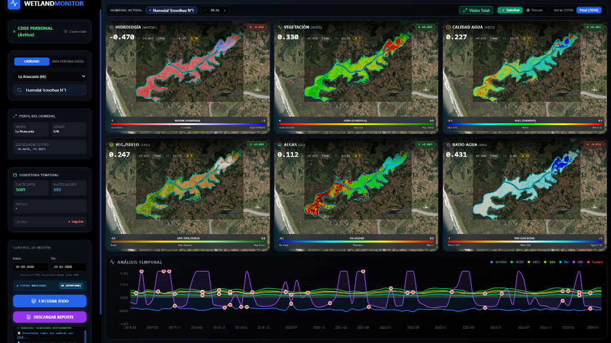

# Wetland Monitor Chile 🛰️💧

**Wetland Monitor** es una plataforma avanzada de análisis geoespacial para el monitoreo de humedales en Chile. Utiliza **Google Earth Engine (GEE)** para procesar imágenes satelitales (Sentinel-2, Sentinel-1) y calcular índices espectrales críticos para la salud de los ecosistemas.

 <!-- Opcional: Agregar captura -->

## 🚀 Características Principales

- **Análisis Multi-Índice**: Cálculo automático de 6 índices clave:
  - 💧 **MNDWI**: Agua superficial y zonas inundables.
  - 🌿 **NDRE**: Salud de la vegetación (Red Edge).
  - 🧪 **NDCI**: Calidad de agua (Clorofila-a).
  - 🌾 **SAVI**: Vegetación densa con ajuste de suelo.
  - 🦠 **FAI**: Floraciones algales flotantes.
  - ⚖️ **WRI**: Ratio Agua/Tierra.
- **Series Temporales Robustas**: Estadísticas resistentes a outliers y nubes.
- **Detección de Anomalías**: Identificación automática de valores atípicos.
- **Reportes Automáticos**: Generación de informes DOCX con mapas, gráficos y estadísticas detalladas.
- **Interfaz Moderna**: Dashboard interactivo con mapas vectoriales y visualización de datos.

## 🛠️ Tecnologías

### Backend
- **Python 3.11+**
- **FastAPI**: API REST de alto rendimiento.
- **Google Earth Engine API**: Procesamiento satelital en la nube.
- **Pandas/Numpy**: Análisis de datos.
- **Matplotlib**: Generación de gráficos estáticos para reportes.

### Frontend
- **Next.js 14 (React)**: Framework web moderno.
- **Tailwind CSS**: Estilizado utility-first.
- **Recharts**: Gráficos interactivos.
- **MapLibre GL**: Visualización de mapas.

---

## 📦 Instalación y Ejecución

### Prerrequisitos
1. **Cuenta de Google Earth Engine**: Debes tener acceso aprobado.
2. **Node.js 18+** y **Python 3.10+**.
3. **Clave de GEE**: Autenticación mediante `gcloud` o Service Account.

### 1. Backend (API)

```bash
cd backend
python -m venv venv
# Windows
.\venv\Scripts\activate
# Linux/Mac
source venv/bin/activate

pip install -r requirements.txt
python main.py
```
El servidor iniciará en `http://localhost:8000`.

### 2. Frontend (Dashboard)

```bash
cd frontend
npm install
npm run dev
```
La aplicación estará disponible en `http://localhost:3000`.

---

## 📚 Referencias Científicas

Este proyecto implementa índices basados en literatura científica rigorosa:
- **NDCI**: Mishra & Mishra (2012) - *Remote Sensing of Environment*.
- **MNDWI**: Xu (2006) - *International Journal of Remote Sensing*.
- **NDRE**: Gitelson & Merzlyak (1994) - *Journal of Plant Physiology*.

*(Ver `REFERENCIAS_CIENTIFICAS.md` para detalles completos)*

---

## 📄 Licencia

Este proyecto es de código abierto.
